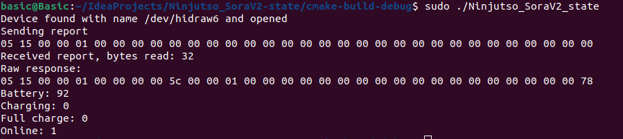

# Ninjutso_SoraV2-state
### Get information about Ninjutso Sora v2 mouse using hidapi (crossplatform)

## The idea for the realisation was taken from [Sora_tray](https://github.com/Fan4Metal/Sora_tray/)

## To run from linux
***Tested on Ubuntu 18.04 (run with root privileges)***
```bash
sudo apt update && sudo apt install -y libudev-dev libusb-dev libusb-1.0-0-dev libhidapi-dev
```
